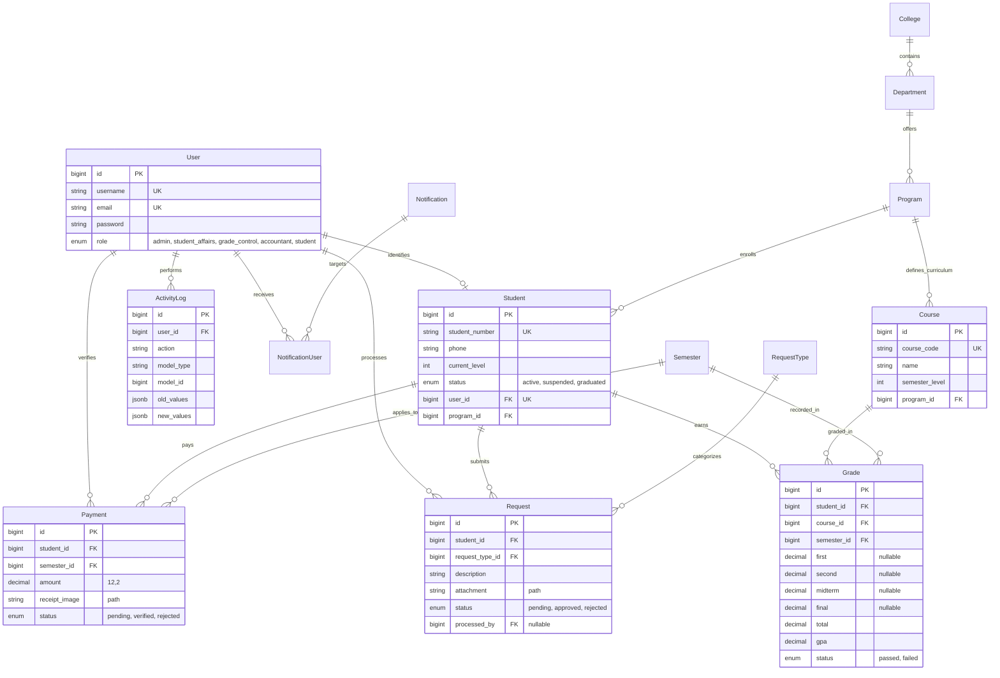

# Implementation Plan - University Service Ecosystem (Static Study Plan)

This plan outlines the restructuring of the database schema to support the "Read/Service-only" student portal logic, strict academic hierarchy, and detailed grading system.

## Goal
Transition the current schema to a strict, level-based curriculum system with enhanced service features (Requests, Payments, Notifications) and detailed audit trails.

## User Review Required
> [!IMPORTANT]
> **Data Structure Changes**:
> *   **Users**: Adding `username` and native `role` ENUM.
> *   **Courses**: Moving ownership from `Department` to `Program` to support strict curriculum mapping.
> *   **Grades**: Expanding from a single `grade` column to detailed breakdown (`first`, `second`, `midterm`, `final`, `total`).
> *   **Requests**: separation into `RequestType` catalog and `Request` entries.
> *   **PostgreSQL Strictness**: Enforcing `JSONB` for logs and `DECIMAL` for financials.

## Proposed Schema (Mermaid ERD)

## Proposed Changes

### 1. Identity & Profile
*   **Modify `users`**:
    *   Add `username` (string, unique).
    *   Add `role` (enum: 'admin', 'student_affairs', 'grade_control', 'accountant', 'student').
*   **Modify `students`**:
    *   Add `phone` (string).
    *   Ensure `user_id` is unique and strictly linked.

### 2. Static Academic Hierarchy
*   **Modify `courses`**:
    *   Add `program_id` (FK).
    *   Drop `department_id` (Logic: Courses belong to a Program's curriculum).

### 3. Temporal Logic & Performance
*   **Modify `grades`**:
    *   Add `first`, `second`, `midterm`, `final` (nullable decimals).
    *   Add `total` (decimal).
    *   Retain `gpa` and `status`.
*   **Modify `semesters`**:
    *   Ensure `year` and `term` structure matches requirements.

### 4. Service Ecosystem
*   **Create `request_types`**:
    *   `name`, `description`, `is_active`.
*   **Modify `requests`**:
    *   Add `request_type_id` (FK).
    *   Remove `request_type` string column.
    *   Add `attachment` (string path).
*   **Modify `payments`**:
    *   Rename `transaction_reference` to `receipt_image` (or keep both if online payment is also needed, but prompt specifies `receipt_image`).
    *   Ensure `amount` is `DECIMAL(12,2)`.

### 5. Communications & Security
*   **Create `notifications`**:
    *   `title`, `message`, `target_type`.
*   **Create `notification_user`** (Pivot):
    *   `notification_id`, `user_id`, `is_read`.
*   **Modify `activity_logs`**:
    *   Ensure `old_values` and `new_values` use `JSONB` type for PostgreSQL.

## Verification Plan
1.  **Run Migrations**: Execute `php artisan migrate:fresh` to apply the strict new schema.
2.  **Model Inspection**: Verify Models have correct `$fillable`, `casts`, and relationships (`belongsTo`, `hasMany`).
3.  **Constraint Testing**: Attempt to insert invalid data (e.g., duplicate student number) to test database-level constraints.
